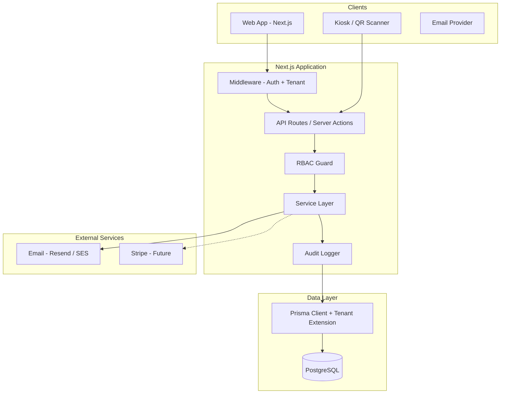
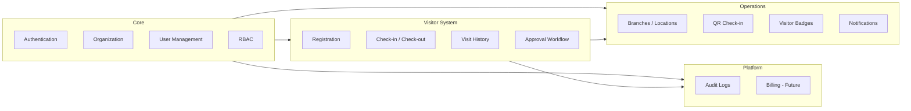
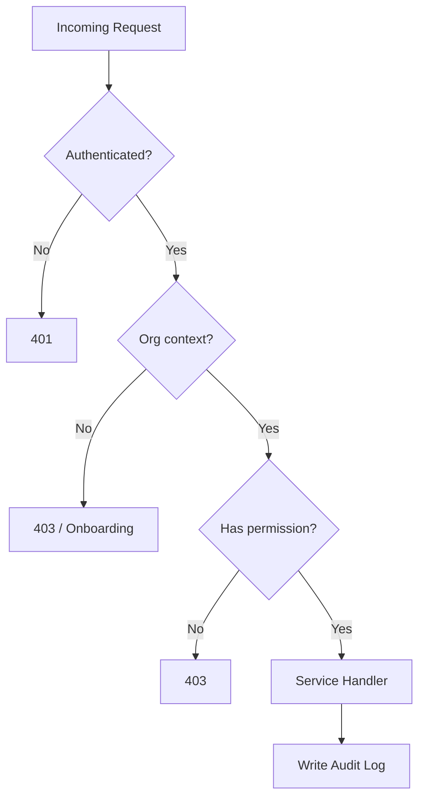
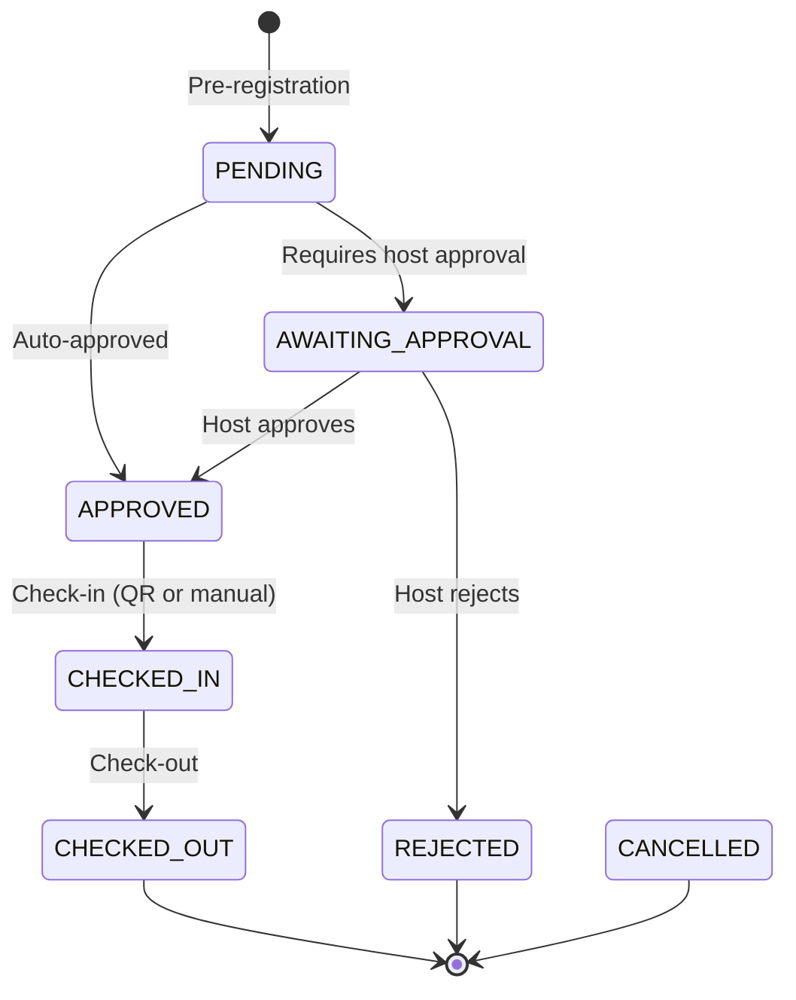

# Entriss — System Architecture

Multi-tenant SaaS Visitor Management System.

**Stack:** Next.js (App Router) · Prisma · PostgreSQL · NextAuth v4  
**Scope of this document:** Architecture and structure only — no UI implementation.

---

## Table of Contents

1. [Architecture Overview](#1-architecture-overview)
2. [Multi-Tenancy](#2-multi-tenancy)
3. [Domain Modules](#3-domain-modules)
4. [Authentication & Authorization](#4-authentication--authorization)
5. [Visitor Lifecycle](#5-visitor-lifecycle)
6. [Operations](#6-operations)
7. [Audit & Compliance](#7-audit--compliance)
8. [Billing Readiness](#8-billing-readiness)
9. [API & Application Layer](#9-api--application-layer)
10. [Folder Structure](#10-folder-structure)
11. [Security Model](#11-security-model)
12. [Scalability & Deployment](#12-scalability--deployment)
13. [Implementation Phases](#13-implementation-phases)

---

## 1. Architecture Overview

Entriss follows a **modular monolith** pattern: a single Next.js application with clear domain boundaries, shared PostgreSQL database, and strict tenant isolation at the data-access layer. This balances SaaS velocity with a path to extract services later (notifications, billing) if needed.



### Design Principles

| Principle | Decision |
|-----------|----------|
| Tenant isolation | Shared DB, shared schema, `organizationId` on every tenant row |
| Identity vs membership | Global `User`; org access via `OrganizationMember` |
| Authorization | RBAC with org-scoped roles and explicit permissions |
| Data access | All queries go through tenant-scoped Prisma client |
| Side effects | Audit log on every mutating action |
| Future billing | `Subscription` / `Plan` models stubbed; feature flags via plan |

---

## 2. Multi-Tenancy

### Strategy: Shared Database, Row-Level Tenant Scoping

Every tenant-owned record carries an `organizationId` foreign key. There is no cross-tenant data access at the application layer.

```
Organization (tenant root)
  ├── Branches
  ├── Members (Users + Roles)
  ├── Visitors
  ├── Visits
  ├── Badges, QR codes, Notifications, Audit logs
  └── Subscription (future)
```

### Tenant Resolution

1. User authenticates via NextAuth (credentials or OAuth).
2. Session stores `userId` and `activeOrganizationId`.
3. Users with multiple org memberships can switch org; session updates `activeOrganizationId`.
4. Middleware and API handlers reject requests without a valid org context (except platform routes and org onboarding).

### Isolation Enforcement (Defense in Depth)

| Layer | Mechanism |
|-------|-----------|
| **Prisma extension** | Injects `organizationId` into `where` on all reads; validates on writes |
| **Service layer** | Every service method requires `TenantContext` |
| **RBAC** | Permissions evaluated within org scope |
| **PostgreSQL RLS** (Phase 2) | Optional row policies keyed on `organization_id` session variable |
| **Unique constraints** | Scoped per org, e.g. `@@unique([organizationId, slug])` |

### TenantContext Type

```typescript
type TenantContext = {
  userId: string;
  organizationId: string;
  memberId: string;
  permissions: string[];
};
```

All domain services receive `TenantContext` as the first argument. No service method operates without it.

---

## 3. Domain Modules



### Module Responsibilities

| Module | Responsibility |
|--------|----------------|
| **auth** | NextAuth config, session, password hashing, invite tokens |
| **organization** | CRUD org, settings, onboarding, org switcher data |
| **users** | Member invites, profile, deactivation |
| **rbac** | Roles, permissions, guards, policy checks |
| **branches** | Locations, timezone, address, check-in config |
| **visitors** | Visitor profiles (org-scoped) |
| **visits** | Visit records, status machine, check-in/out |
| **approvals** | Host approval workflow before/during visit |
| **qr** | QR token generation, validation, kiosk endpoints |
| **badges** | Badge templates, print data, visit linkage |
| **notifications** | Email queue, templates, delivery status |
| **audit** | Immutable action log |
| **billing** | Plan limits, subscription state (stub) |

---

## 4. Authentication & Authorization

### Authentication (NextAuth v4)

| Concern | Approach |
|---------|----------|
| Provider | Credentials (email + password) first; OAuth (Google/Microsoft) later |
| Password storage | `bcryptjs` via NextAuth Credentials provider |
| Session | JWT strategy with `userId`, `activeOrganizationId`, `memberId` |
| Adapter | Prisma adapter for `Account`, `Session`, `VerificationToken` |
| Invites | Magic-link or token-based invite flow for new members |

### Session Payload

```typescript
interface SessionUser {
  id: string;
  email: string;
  name: string | null;
  activeOrganizationId: string | null;
  memberId: string | null;
  permissions: string[];
}
```

### RBAC Model

**System roles** (seeded per organization, customizable later):

| Role | Typical permissions |
|------|---------------------|
| `OWNER` | Full org control, billing, delete org |
| `ADMIN` | User/branch management, all visitor ops |
| `RECEPTIONIST` | Check-in/out, register visitors, view history |
| `HOST` | Approve visits for self, view own visitors |
| `SECURITY` | View all visits, override check-in, audit read |
| `VIEWER` | Read-only dashboards and reports |

**Permission format:** `resource:action` (e.g. `visit:check_in`, `member:invite`, `branch:manage`).



Roles are stored in `Role`; permissions in `Permission`; mapping in `RolePermission`. Each `OrganizationMember` has one `roleId`.

---

## 5. Visitor Lifecycle

> **Domain model:** See [product-model.md](./product-model.md) for canonical Visitor vs Visit definitions, Host/Branch rules, and creation flows.

### Visit Status State Machine



### Entities

| Entity | Purpose |
|--------|---------|
| **Visitor** | Person profile: name, email, phone, company, photo (org-scoped) |
| **Visit** | Single visit instance: host, branch, purpose, scheduled time, status |
| **VisitApproval** | Approval record: approver, decision, notes, timestamp |
| **VisitEvent** | Timeline entries (status changes, notes) for history |

### Registration Flows

1. **Walk-in** — Receptionist registers visitor + creates visit → check-in immediately or await approval.
2. **Pre-registration** — Host or visitor submits form → approval if required → visitor arrives → QR/manual check-in.
3. **Recurring visitor** — Existing `Visitor` record reused; new `Visit` per arrival.

### Check-in / Check-out

- **Manual:** Receptionist action with `visit:check_in` permission.
- **QR:** Visitor scans branch QR or personal visit QR; kiosk/public endpoint validates token.
- **Check-out:** Manual or automatic (configurable timeout per branch).

---

## 6. Operations

### Branches / Locations

Each `Branch` belongs to one organization.

| Field group | Examples |
|-------------|----------|
| Identity | name, slug, code |
| Location | address, timezone |
| Config | `requiresApproval`, `autoCheckoutHours`, `badgeTemplateId` |
| QR | `qrSecret` (rotatable), public check-in URL slug |

### QR Code System

| QR Type | Encodes | Use case |
|---------|---------|----------|
| **Branch QR** | `branchId` + signed token | Lobby kiosk — starts check-in for walk-ins |
| **Visit QR** | `visitId` + signed token | Pre-registered visitor — fast check-in |

- Tokens are **HMAC-signed**, short-lived for visit QR, long-lived (rotatable) for branch QR.
- Public routes: `GET /api/v1/public/check-in/validate`, `POST /api/v1/public/check-in/confirm`
- No auth required; token + visit state validation only.

### Visitor Badge System

| Component | Description |
|-----------|-------------|
| `BadgeTemplate` | Org-level layout config (fields, logo, colors) |
| `VisitorBadge` | Generated per check-in: badge number, visit link, expiry |
| Badge number | Sequential per branch per day: `BR-001` |

Badge data is computed server-side and returned as JSON for print/PDF (UI later).

### Notifications (Email First)

| Event | Recipients |
|-------|------------|
| Visit pre-registered | Host, visitor (confirmation) |
| Approval required | Host |
| Approved / Rejected | Visitor, receptionist (optional) |
| Checked in | Host |
| Checked out | Visitor (thank you), security (optional) |
| Member invited | Invitee |

**Architecture:**

```
Domain Event → NotificationService → Notification (queued) → EmailProvider (Resend/SES)
```

`Notification` table stores: type, recipient, payload, status (`PENDING` | `SENT` | `FAILED`), `sentAt`.

---

## 7. Audit & Compliance

Every mutating action writes an `AuditLog` row **in the same transaction** as the business change.

| Field | Purpose |
|-------|---------|
| `organizationId` | Tenant scope |
| `actorId` | User who performed action (null for system/public) |
| `action` | e.g. `visit.checked_in`, `member.invited` |
| `resourceType` / `resourceId` | What changed |
| `metadata` | JSON diff / context |
| `ipAddress`, `userAgent` | Request context |
| `createdAt` | Immutable timestamp |

Audit logs are **append-only**. No updates or deletes from application code.

---

## 8. Billing Readiness

Models are defined but integration is deferred. Architecture supports:

| Model | Purpose |
|-------|---------|
| `Plan` | `name`, `slug`, `limits` (JSON: max branches, users, visits/month) |
| `Subscription` | `organizationId`, `planId`, `status`, `currentPeriodEnd`, `stripeCustomerId` (nullable) |
| `UsageRecord` | Monthly counters for metered billing |

**Feature gating:** `lib/billing/limits.ts` checks plan limits before create operations (e.g. branch count). Returns structured errors for upgrade prompts (UI later).

---

## 9. API & Application Layer

### Route Organization

```
app/
├── api/
│   ├── auth/[...nextauth]/route.ts    # NextAuth handler
│   └── v1/
│       ├── organizations/             # Org CRUD, switch
│       ├── members/                   # User management
│       ├── branches/
│       ├── visitors/
│       ├── visits/
│       ├── approvals/
│       ├── badges/
│       ├── notifications/
│       ├── audit/
│       └── public/
│           └── check-in/              # QR validation (no session)
```

### Handler Pattern

```typescript
// lib/api/with-tenant.ts
export function withTenant(permission: string, handler: Handler) {
  return async (req: Request) => {
    const ctx = await resolveTenantContext(req);      // auth + org + permissions
    if (!ctx) return unauthorized();
    if (!hasPermission(ctx, permission)) return forbidden();
    return handler(req, ctx);
  };
}
```

### Server Actions (Alternative)

Dashboard mutations can use Server Actions with the same `TenantContext` resolution. API routes are preferred for kiosk/public endpoints and future mobile clients.

### Validation

- **Zod** schemas in `lib/validations/` per domain.
- Validate at API boundary; services receive typed DTOs.

### Error Handling

Standard error shape:

```typescript
{ error: { code: string; message: string; details?: unknown } }
```

---

## 10. Folder Structure

```
entriss/
├── app/
│   ├── (auth)/                        # Route group — no UI yet
│   │   ├── login/
│   │   ├── register/
│   │   └── invite/[token]/
│   ├── (dashboard)/                   # Authenticated tenant app
│   │   └── [orgSlug]/                 # Org-scoped routes (future)
│   ├── api/
│   │   ├── auth/[...nextauth]/
│   │   └── v1/                        # REST API per module
│   ├── generated/prisma/              # Prisma client output
│   ├── layout.tsx
│   └── page.tsx
│
├── lib/
│   ├── auth/
│   │   ├── config.ts                  # NextAuth options
│   │   ├── session.ts                 # getServerSession helpers
│   │   └── password.ts                # hash / verify
│   ├── db/
│   │   ├── client.ts                  # Prisma singleton
│   │   └── tenant-extension.ts        # Auto-scope queries
│   ├── tenant/
│   │   ├── context.ts                 # TenantContext type + resolver
│   │   └── middleware.ts              # Org resolution helpers
│   ├── rbac/
│   │   ├── permissions.ts             # Permission constants
│   │   ├── roles.ts                   # Default role definitions
│   │   └── guard.ts                   # hasPermission, requirePermission
│   ├── services/                      # Domain service layer
│   │   ├── organization.service.ts
│   │   ├── member.service.ts
│   │   ├── branch.service.ts
│   │   ├── visitor.service.ts
│   │   ├── visit.service.ts
│   │   ├── approval.service.ts
│   │   ├── qr.service.ts
│   │   ├── badge.service.ts
│   │   └── notification.service.ts
│   ├── audit/
│   │   └── logger.ts                  # AuditLog writer
│   ├── billing/
│   │   ├── limits.ts                  # Plan limit checks (stub)
│   │   └── plans.ts                   # Plan definitions
│   ├── notifications/
│   │   ├── email.ts                   # Provider abstraction
│   │   └── templates/                 # Email template functions
│   ├── validations/                   # Zod schemas
│   ├── api/
│   │   ├── with-tenant.ts
│   │   └── response.ts                # Standard API responses
│   └── utils/
│       ├── crypto.ts                  # HMAC for QR tokens
│       └── id.ts
│
├── prisma/
│   ├── schema.prisma                  # Full data model
│   ├── migrations/
│   └── seed.ts                        # Roles, permissions, demo plan
│
├── types/
│   ├── next-auth.d.ts                 # Session type augmentation
│   └── index.ts
│
├── docs/
│   └── ARCHITECTURE.md                # This file
│
├── middleware.ts                      # Auth redirect, org context
└── .env                               # DATABASE_URL, NEXTAUTH_SECRET, etc.
```

---

## 11. Security Model

| Area | Measure |
|------|---------|
| Authentication | bcrypt passwords, secure session cookies, `NEXTAUTH_SECRET` |
| Authorization | RBAC on every protected route |
| Tenant isolation | Prisma extension + service-layer enforcement |
| QR tokens | HMAC-SHA256, expiry, constant-time comparison |
| Public endpoints | Rate limiting (middleware), minimal data exposure |
| Input | Zod validation, Prisma parameterized queries |
| Secrets | Environment variables only; never in client bundle |
| CSRF | NextAuth built-in for auth routes; SameSite cookies |
| Audit | Full trail for compliance and incident response |

### Environment Variables

```
DATABASE_URL=
NEXTAUTH_URL=
NEXTAUTH_SECRET=
QR_SIGNING_SECRET=
EMAIL_FROM=
RESEND_API_KEY=          # or SMTP_* for other providers
```

---

## 12. Scalability & Deployment

### Current (Phase 1)

- Single Next.js deployment (Vercel or container)
- Managed PostgreSQL (Neon, Supabase, RDS)
- Stateless app — horizontal scale via serverless instances
- Prisma connection pooling (PgBouncer / Neon pooler)

### Future Scaling Levers

| Bottleneck | Scale path |
|------------|------------|
| Email volume | Background job queue (Inngest, BullMQ + Redis) |
| Heavy reports | Read replicas, materialized views |
| File uploads (photos) | S3 + presigned URLs |
| Multi-region | Read replicas per region; CDN for static |
| Billing webhooks | Dedicated `/api/webhooks/stripe` route |

### Caching Strategy (Later)

- Org settings and RBAC permissions: short TTL in-memory or Redis
- Branch list: cache per org, invalidate on mutation

---

## 13. Implementation Phases

| Phase | Deliverables |
|-------|--------------|
| **1 — Foundation** | Prisma schema, migrations, seed roles/permissions, Prisma client + tenant extension, NextAuth, TenantContext |
| **2 — Core** | Organization + member CRUD, RBAC guards, audit logger |
| **3 — Branches** | Branch CRUD, org settings |
| **4 — Visitors** | Visitor + Visit models, registration, status machine |
| **5 — Check-in** | Manual check-in/out, visit history, VisitEvent timeline |
| **6 — Approvals** | Approval workflow, host notifications |
| **7 — QR** | Token signing, public check-in API, branch QR rotation |
| **8 — Badges** | Badge templates, badge generation on check-in |
| **9 — Notifications** | Email provider, templates, notification queue |
| **10 — Billing stub** | Plan/Subscription models, limit checks |
| **11 — UI** | Dashboard, kiosk, admin screens |

---

## Related Artifacts

- **Data model:** `prisma/schema.prisma`
- **Permission catalog:** `lib/rbac/permissions.ts` (to be created in Phase 1)
- **Default roles:** `lib/rbac/roles.ts` (to be created in Phase 1)
