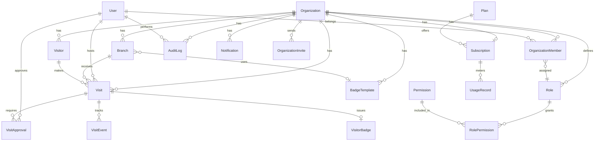

# Entriss — Data Model Reference

Companion to [ARCHITECTURE.md](./ARCHITECTURE.md) and [product-model.md](./product-model.md) (canonical Visitor / Visit / Host / Branch domain rules). Prisma source of truth: `prisma/schema.prisma`.

---

## Entity Relationship Overview



---

## Tenant Boundary

All tables below require `organizationId` except platform-global tables:

| Scope | Tables |
|-------|--------|
| **Global** | `User`, `Account`, `Session`, `VerificationToken`, `Permission`, `Plan` |
| **Tenant** | Everything else |

Cross-tenant queries are forbidden. `User` is global; tenant access is always mediated through `OrganizationMember`.

---

## Table Summary

| Table | Purpose | Key indexes |
|-------|---------|-------------|
| `organizations` | Tenant root | `slug` unique |
| `organization_members` | User ↔ org + role | `(organizationId, userId)` unique |
| `organization_invites` | Pending member invites | `token` unique |
| `roles` | Org or system roles | `(organizationId, slug)` unique |
| `permissions` | Global permission catalog | `slug` unique |
| `role_permissions` | Role ↔ permission M2M | composite PK |
| `branches` | Physical locations | `(organizationId, slug)` unique |
| `visitors` | Visitor profiles | `organizationId`, `(organizationId, email)` |
| `visits` | Visit instances | `organizationId`, `status`, `branchId`, `hostId` |
| `visit_approvals` | Approval decisions | `visitId` |
| `visit_events` | Visit timeline | `visitId` |
| `badge_templates` | Badge layouts | `organizationId` |
| `visitor_badges` | Issued badges | `visitId` unique |
| `notifications` | Outbound messages | `organizationId`, `status` |
| `audit_logs` | Immutable audit trail | `(organizationId, createdAt)` |
| `plans` | Billing plans | `slug` unique |
| `subscriptions` | Org subscription | `organizationId` unique |
| `usage_records` | Metered usage | `(subscriptionId, metric, periodStart)` |

---

## Visit Status Transitions

| From | To | Trigger |
|------|-----|---------|
| `PENDING` | `AWAITING_APPROVAL` | Branch/org requires approval |
| `PENDING` | `APPROVED` | Auto-approve enabled |
| `AWAITING_APPROVAL` | `APPROVED` | Host approves |
| `AWAITING_APPROVAL` | `REJECTED` | Host rejects |
| `APPROVED` | `CHECKED_IN` | QR or manual check-in |
| `CHECKED_IN` | `CHECKED_OUT` | Manual or auto timeout |
| `*` | `CANCELLED` | Admin/receptionist cancels |

Each transition creates a `VisitEvent` and an `AuditLog` entry.

---

## Cascading Deletes

| Parent deleted | Effect |
|----------------|--------|
| `Organization` | Cascades all tenant data |
| `User` | Cascades memberships, sessions, accounts; visits retain if host deleted — **consider soft-delete for users in production** |
| `Visit` | Cascades approvals, events, badge |
| `Branch` | Blocked if active visits exist (enforce in service layer) |

---

## JSON Field Schemas

### `Organization.settings`

```json
{
  "defaultRequiresApproval": false,
  "visitorFieldsRequired": ["email"],
  "emailNotificationsEnabled": true,
  "badgePrefix": "V"
}
```

### `Plan.limits`

```json
{
  "maxBranches": 5,
  "maxMembers": 25,
  "maxVisitsPerMonth": 1000
}
```

### `BadgeTemplate.config`

```json
{
  "showPhoto": true,
  "showCompany": true,
  "showHost": true,
  "fields": ["name", "company", "host", "badgeNumber", "checkedInAt"]
}
```
