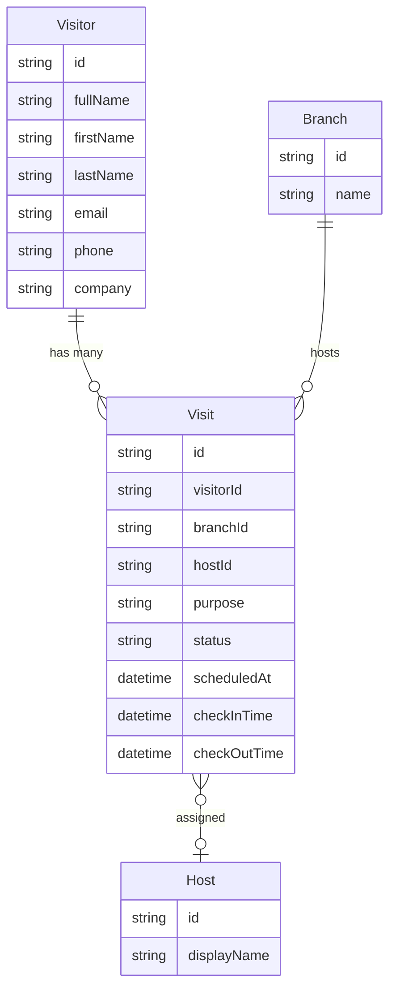

# Entriss — Product Domain Model

Canonical conceptual model for how the product represents people, visits, locations, and hosts.

**Related docs:** [ARCHITECTURE.md](./ARCHITECTURE.md) (system design) · [DATA-MODEL.md](./DATA-MODEL.md) (Prisma tables & indexes)

---

## Core principle

> **Visitor ≠ Visit**

| Concept | Meaning |
|---------|---------|
| **Visitor** | Who the person is (identity, reusable within an organization) |
| **Visit** | One instance of that person coming to a branch on a given occasion |

A single Visitor may have many Visits over time. All check-in, approval, QR, and badge behavior applies to the **Visit**, not the Visitor profile alone.

---

## Entity relationship



---

## Visitor

Represents a **person** — identity only. No visit state, no branch, no check-in timestamps.

| Field | Description |
|-------|-------------|
| `id` | Stable identifier within the organization |
| `fullName` | Display name (derived: `firstName` + `lastName`) |
| `firstName` | Given name |
| `lastName` | Family name |
| `email` | Contact email (optional but used for deduplication) |
| `phone` | Contact phone (optional but used for deduplication) |
| `company` | Visitor's organization (optional) |

**Scope:** One Visitor record per person per tenant (`organizationId`). Returning guests are matched by email/phone via `getOrCreateVisitor`, not recreated on every arrival.

**Visitor is not:**

- A check-in event
- A booking by itself
- Tied to a single branch or host

---

## Visit

Represents an **event** — one occasion of a Visitor attending a Branch.

| Field | Description |
|-------|-------------|
| `id` | Unique visit instance |
| `visitorId` | Required reference to `Visitor` |
| `branchId` | Required reference to `Branch` |
| `hostId` | Internal employee hosting the visit (see [Host](#host)) |
| `purpose` | Reason for the visit |
| `status` | Lifecycle state (see below) |
| `scheduledAt` | Expected arrival time (pre-registration / scheduled visits) |
| `checkInTime` | Actual check-in timestamp (`null` until checked in) |
| `checkOutTime` | Actual check-out timestamp (`null` until checked out) |

### Visit status

Primary states referenced in product flows:

| Status | Meaning |
|--------|---------|
| `PENDING` | Created; not yet approved or checked in |
| `APPROVED` | Cleared to check in |
| `CHECKED_IN` | On-site |
| `CHECKED_OUT` | Departed |

Additional system states (`AWAITING_APPROVAL`, `REJECTED`, `CANCELLED`) extend this lifecycle when branch/org policies require approval or staff intervention.

**Rules:**

- Every Visit **must** reference a Visitor (`visitorId`).
- Every Visit **must** reference a Branch (`branchId`).
- QR tokens, badge numbers, and timeline events belong to the Visit.

---

## Host

An **internal employee** (`OrganizationMember`) responsible for the visit.

| Rule | Detail |
|------|--------|
| **Source of truth** | Authenticated session context (`memberId` / `hostMemberId`) |
| **Not a visitor input** | Kiosk and staff flows must not treat free-text or visitor-entered names as the host |
| **Assignment** | Stored on the Visit as `hostId` (implementation: `hostMemberId`) |

On the kiosk, the logged-in reception operator's membership is the host. Visitors do not pick or type a host name.

---

## Branch

The **operational location** where a visit takes place. Drives policies (approval, walk-ins, kiosk, visit hours, badge printing).

| Rule | Detail |
|------|--------|
| **Canonical source** | `GET /api/v1/branches` — branch list and selection must resolve from the branches API |
| **Per-visit context** | Every Visit is scoped to exactly one Branch |
| **Policies** | Resolved via `config.operational` on `ResolvedBranchConfig` (see settings layer) |

Branch is location context, not person identity.

---

## Creation flows

### Registration (walk-in / kiosk / reception)

Registration is a **compound operation** that may create or reuse identity and always creates an event:

```
Registration
├── Visitor  →  created if new (getOrCreateVisitor)
│               reused if email/phone matches existing
└── Visit    →  always created
```

Service entry point: `registerVisitorVisit` (`lib/services/visit.service.ts`).

### Pre-registration (`/visits/new`)

Pre-registration is a **Visit creation flow**, not a Visitor-only flow.

```
Pre-registration
├── Visitor  →  created or matched as needed (same as registration)
└── Visit    →  created with scheduledAt, branch, host, purpose
                status driven by branch approval policy
                no automatic check-in
```

Staff schedule an upcoming **Visit** for a **Visitor**. The UI is visit-centric: host, branch, datetime, and purpose describe the event.

API: `POST /api/v1/visits` with register payload.

### Visitor-only CRUD

Creating or editing a Visitor record alone (`/visitors`, `POST /api/v1/visitors`) does **not** create a Visit. Use this for profile maintenance only.

---

## Flow matrix

| User action | Visitor | Visit | Typical entry |
|-------------|---------|-------|---------------|
| Walk-in kiosk register | create or match | create | `registerVisitorVisit` |
| Staff pre-register | create or match | create | `POST /api/v1/visits` |
| QR check-in | — | update status | `checkInVisit` |
| Booking lookup + check-in | — | update status | `checkInVisit` |
| Add visitor profile only | create | — | `createVisitor` |

---

## Implementation mapping

Canonical product names map to Prisma / API fields as follows:

| Product model | Implementation (`prisma/schema.prisma`) |
|---------------|----------------------------------------|
| `Visitor.fullName` | Derived: `` `${firstName} ${lastName}` `` |
| `Visit.hostId` | `Visit.hostMemberId` → `OrganizationMember.id` |
| `Visit.checkInTime` | `Visit.checkedInAt` |
| `Visit.checkOutTime` | `Visit.checkedOutAt` |
| `Host` | `OrganizationMember` (+ linked `User` for display name) |
| `Branch` | `Branch` model; list via `/api/v1/branches` |

**Note:** `hostMemberId` is required at the database layer. Product rule: the value must come from session context in kiosk flows, not from visitor-supplied fallback text.

---

## Invariants (do not violate)

1. **Visitor ≠ Visit** — never store check-in state on Visitor alone.
2. **Visit always has a Visitor** — `visitorId` is mandatory.
3. **Visit always has a Branch** — `branchId` is mandatory; resolve branches from `/api/v1/branches`.
4. **Host is internal** — assign from authenticated staff session, not visitor free text.
5. **Registration creates a Visit** — always; Visitor creation is conditional on identity match.
6. **Pre-registration is visit scheduling** — `/visits/new` creates a Visit (and Visitor if needed), not a standalone person record.
